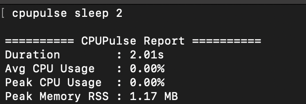
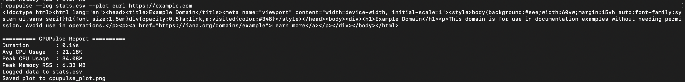
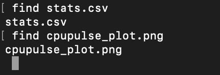

# cpuPulse

- this allows you to run any command and note its cpu and memory usage
- particularly useful for burst processes (when you have to note these values but the command runs so fast that you cannot note pid and check using top etc.)
- can handle keyboard interrupts as well.
- still in version 1
- next versions aim to provide improvements in cli usage. 


## usage

```cpupulse``` is written in Go, and therefore you can just grab the binary releases and drop it in your $PATH.

#usage
```
cpupulse [--log filename.csv] [--plot] <command> [args...]
```
## examples 
- ``` cpupulse sleep 2``` 


    


- ``` cpupulse --log stats.csv curl https://example.com```


    

    

## update 1
- version 2 built -> logs cpu and memory data of each sample in a csv file.
- plots cpu and memory usage vs samples and saves it as a png file.

## update 2
- added cross-platform binaries.
- no need to build from source.
- download binaries for Linux, macOS (Intel & ARM), and Windows from the Releases ([text](https://github.com/Aashi-001/cpuPulse/releases/tag/v1.0)) page.
- after download make sure to give execution privilages to the binary (use `chmod +x 'binary-name'`)
- run `./'binary-name' command` (similar to examples stated).

## update 3
- download binaries for Linux, macOS (Intel & ARM), and Windows from the Releases ([text](https://github.com/Aashi-001/cpuPulse/releases/tag/v1.0.2)) page.
- add the binary to your $PATH.
- follow the usage section.


